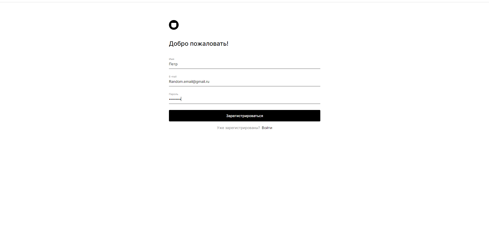
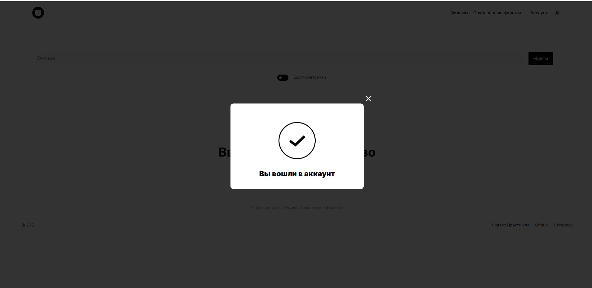
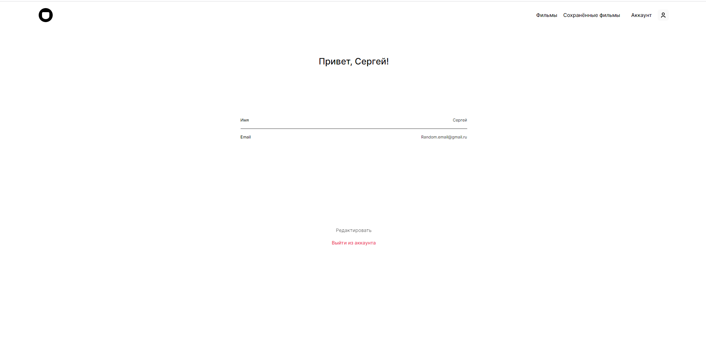
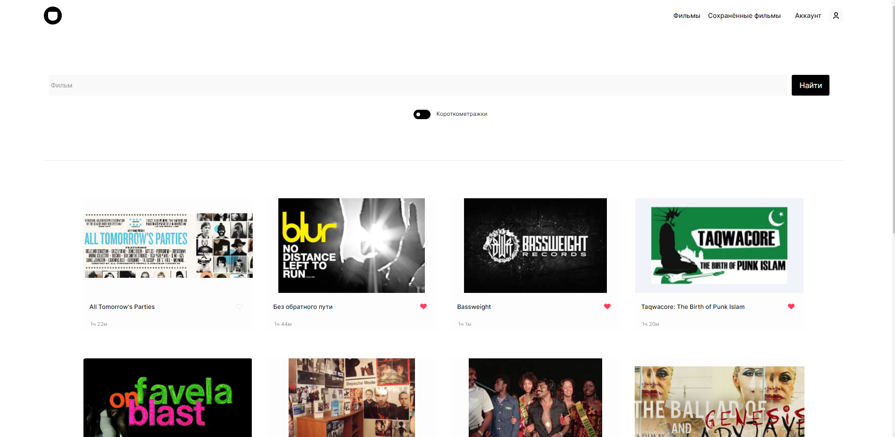
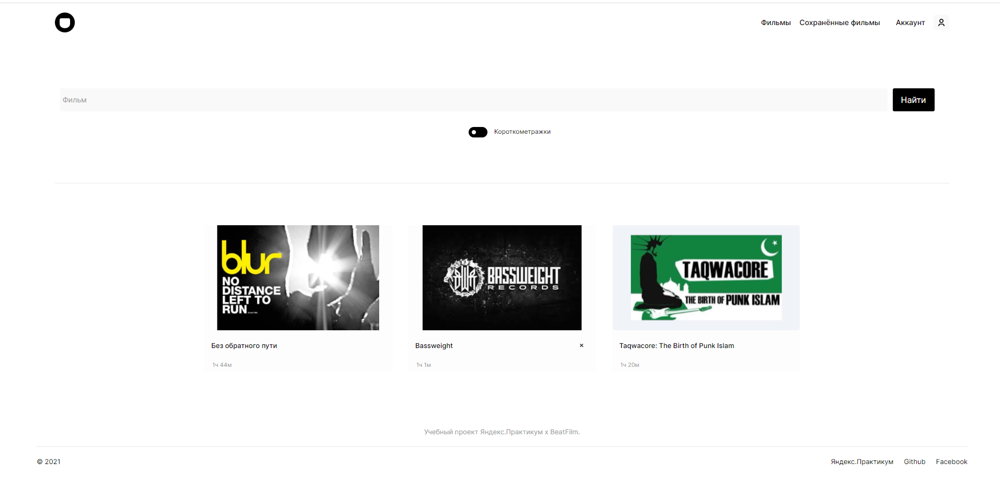

# Дипломная работа Movies-explorer

Ссылка на сайт: https://mxnsoon.movies.nomoredomains.icu/
Ссылка на бэкенд: https://api.mxnsoon.movies.nomoredomains.club/

  
Под спойлером показаны картинки проекта

  

  

## Обзор
Проект Movies-explorer создан с помощью JavaScript, HTML, CSS, React, и самописного бэкенда.
Это одностраничное приложение для поиска фильмов по базе данных Beats-film, где можно добавлять, удалять и смотреть трейлеры ваших любимых фильмов.

## Функционал:

- Отзывчивая вёрстка, которая корректно тянется на всех промежуточных разрешениях
- Валидация форм
- Реализована регистрация и авторизация пользователей
- Реализована страница редактирования профиля
- Поиск фильма по ключевому слову

## Пакеты, которые используются в сборке: 

- React, React-dom, и внутренние библиотеки React'a

## Инструкции по запуску: 

- Скачать или склонировать репозитории
- Скачать или склонировать репозиторий бэкенда, ссылка на него: https://github.com/Mxnsoon/movies-explorer-api
- Установить MongoDB
- В директории фронтенда по пути src/utils/MainApi.js раскомментировать значение base url 'http://localhost:3001'
- Установить npm зависимости на бэкенде и фронтенде
- Локально запустить бэкенд командой npm start
- Локально запустить фронтэнд командой npm start

